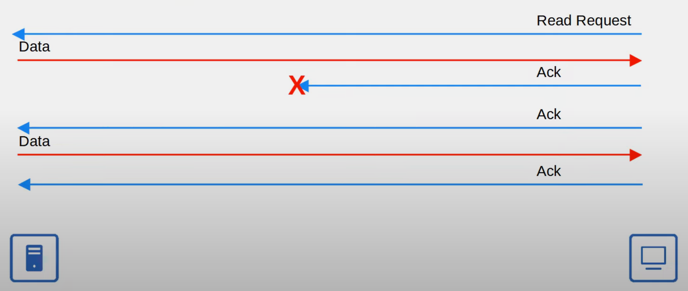

# Day 39

**DHCP** (Dynamic Host Configuration Protocol) is used to allow hosts to automatically learn various aspects of their network configuration, such as IP address, subnet mask, default gateway, etc. without manual configuration. It is typically used for client devices. Devices such as routers and servers are usually configured manually. In small networks, the router typically acts as the DHCP server for hosts in the LAN. In larger networks, the DHCP server is usually a Windows/Linux server. DHCP servers use UDP port 67, clients - UDP port 68.

#### DHCP Release

DHCP servers lease IP addresses to clients. These leases are usually not permanent, and the client must give up the address at the end of the lease. The command to release (give up) the IP address on Windows is `ipconfig /release`. DHCP Release message is unicast.

<figure><figcaption></figcaption></figure>

#### DORA

Then, the command to get a new address is `ipconfig /renew`. Here is the process of getting an IP address from a DHCP server.

<figure><figcaption></figcaption></figure>

* DHCP **Discover** message is broadcast.&#x20;
* DHCP **Offer** message is broadcast or unicast depending on the client's request.&#x20;
* DHCP **Request** message is broadcast.
* DHCP **Ack** message is broadcast or unicast depending on the client's request.&#x20;

#### DHCP Relay Agent

Large enterprises often choose to use a centralized DHCP server. If the server is centralized, it can't receive the DHCP clients' broadcast DHCP messages. In such cases, a router is configured to act as a **DHCP relay agent**. The router forwards the clients' broadcast DHCP messages to the remote DHCP server as unicast messages. Here is how it works.

<figure><figcaption></figcaption></figure>

#### Cisco IOS

To configure a router as a **DHCP server**:

1. Specify a range of addresses that won't be given to DHCP clients - `ip dhcp excluded-address` followed by the low end of the range and the top end of the range. E.g. `ip dhcp excluded-address 192.168.0.1 192.168.0.10`. This command is not necessary but it's good to reserve some address space for network devices, etc.
2. Create a DHCP pool - `ip dhcp pool` followed by the pool name. DHCP pool is a subnet of addresses that can be assigned to DHCP clients. A separate DHCP pool needs to be created for every network where a router acts as a DHCP server.&#x20;
3. Specify the subnet of addresses to be assigned to clients - `network` followed by the network address and network mask/prefix length.
4. Specify the DNS server that DHCP clients should use - `dns-server` followed by the IP address of the DNS server.
5. Specify the domain name of the network - `domain-name` followed by the name.
6. Specify the default gateway - `default-router` followed by the IP address.
7. Specify the lease time - `lease` followed by the number of days, hours, and minutes. E.g. `lease 0 5 30` configures the lease time for 5 hours and 30 minutes. You can also enter `lease infinite` but it's not recommended.

To view the list of DHCP clients that are currently assigned IP addresses, use the command `show ip dhcp binding`.

To configure a router as a **DHCP relay agent**, from the interface which is connected to DHCP clients enter the command `ip helper-address` followed by the IP address of the DHCP server.

Even though it is rare, to configure a router as a **DHCP client**, enter the command `ip address dhcp` from the interface config mode.

<figure><figcaption>
Summary
</figcaption></figure>






