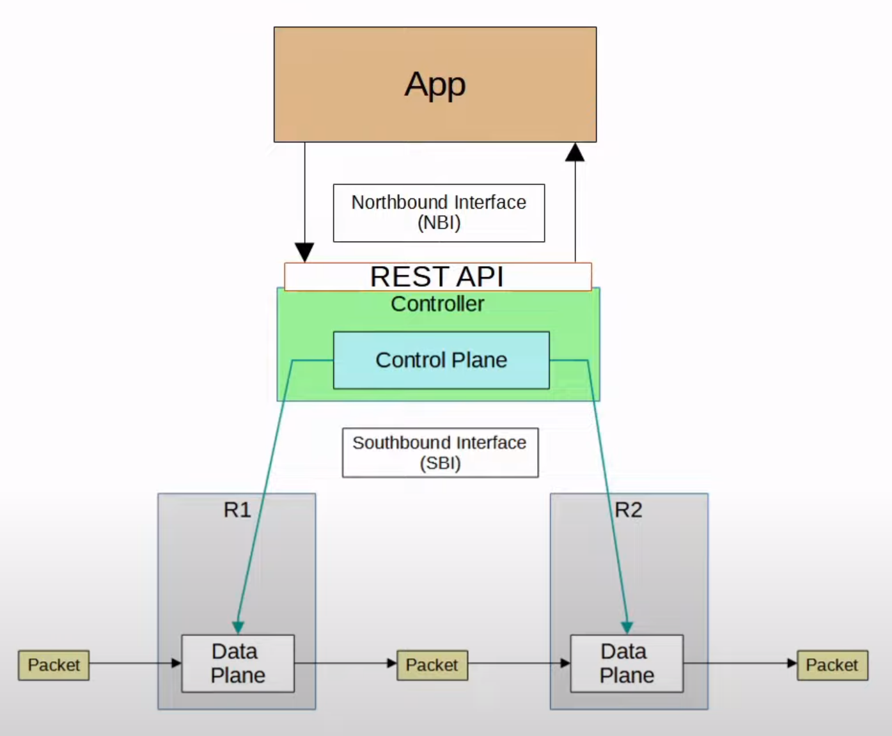

# Day 41

**Syslog** is an industry-standard protocol for message logging. Syslog can be used to log events like changes in interface status, OSPF neighbour status, system restarts, etc. The messages can be displayed in the CLI of the devices saved in the RAM or sent to an external Syslog server. Logs are an essential part of troubleshooting, examining the cause of incidents, etc.&#x20;

#### Message format

<figure><figcaption></figcaption></figure>

* A sequence number indicates the sequence of messages. May or may not be displayed, depending on the device's configuration. To configure the sequence number to be displayed, enter the command `service sequence-numbers` from the global config mode.
* A timestamp indicates the time the message is generated. May or may not be displayed, depending on the device's configuration. To configure the timestamp, enter the command `service timestamps log` followed by `datetime` - for timestamp with date and time, `uptime` - for timestamp with system uptime.
* A facility indicates the process which generated the message.
* A severity number indicates the severity of the logged event.
* A mnemonic is a short code for the message indicating what happened.&#x20;
* A description is a detailed information on the event being reported.

#### Severity levels

<table><thead><tr><th width="166.33333333333331">Level</th><th width="279">Keyword</th><th>Description</th></tr></thead><tbody><tr><td>0</td><td><strong>Emergency</strong></td><td>System is unusable</td></tr><tr><td>1</td><td><strong>Alert</strong></td><td>Action must be taken immediately</td></tr><tr><td>2</td><td><strong>Critical</strong></td><td>Critical conditions</td></tr><tr><td>3</td><td><strong>Error</strong></td><td>Error conditions</td></tr><tr><td>4</td><td><strong>Warning</strong></td><td>Warning conditions</td></tr><tr><td>5</td><td><strong>Notice</strong> (<strong>Notification</strong>)</td><td>Normal but significant condition</td></tr><tr><td>6</td><td><strong>Informational</strong></td><td>Informational messages</td></tr><tr><td>7</td><td><strong>Debugging</strong></td><td>Debug-level messages</td></tr></tbody></table>

Every Awesome Cisco Engineer Will Need Ice-cream Daily - the good way to remember the severity level keywords.

#### Logging locations

* **Console line**: Syslog messages are displayed in the CLI when connected to the device via the console port. By default, all messages (Level 0-7) are displayed.
* **VTY lines**: Syslog messages are displayed in the CLI when connected to the device via Telnet/SSH. Disabled by default.
* **Buffer**: Syslog messages will be saved to RAM. By default, all messages are displayed.
* **External server**: A device can be configured to send the Syslog messages to an external server. Syslog servers listen on UDP port 514.&#x20;

#### Configuration

* Configure logging to the console line -  `logging console` followed by the severity level number or keyword. This enables logging for the specified severity level and higher.
* Configure logging to the VTY lines - `logging monitor` followed by the severity level. By default, Syslog messages are not displayed. To display them, use the command `terminal monitor` every time you connect to the device via Telnet or SSH.
* Configure logging to the buffer - `logging buffered` followed by the buffer size in bytes and the severity level.
* Configure logging to an external server - `logging` or `logging host` followed by the server IP address. To set the logging level - `logging trap` followed by the severity level.

By default, logging messages are displayed in the CLI while you are in the middle of typing a command. To prevent this, use the command `logging synchronous` on the appropriate line. This causes a new line to be printed if your typing is interrupted by a logging message.

<figure><figcaption>
Summary
</figcaption></figure>






